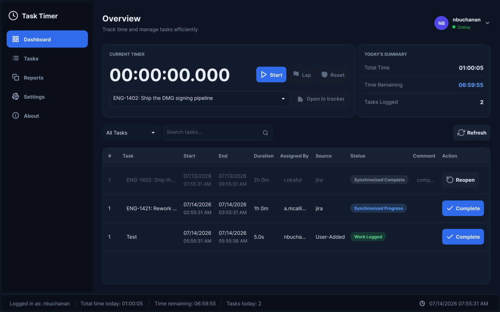
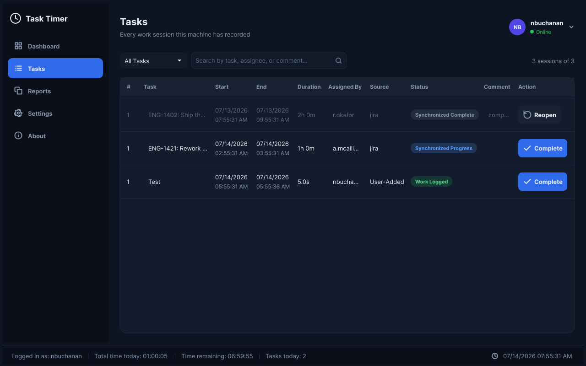
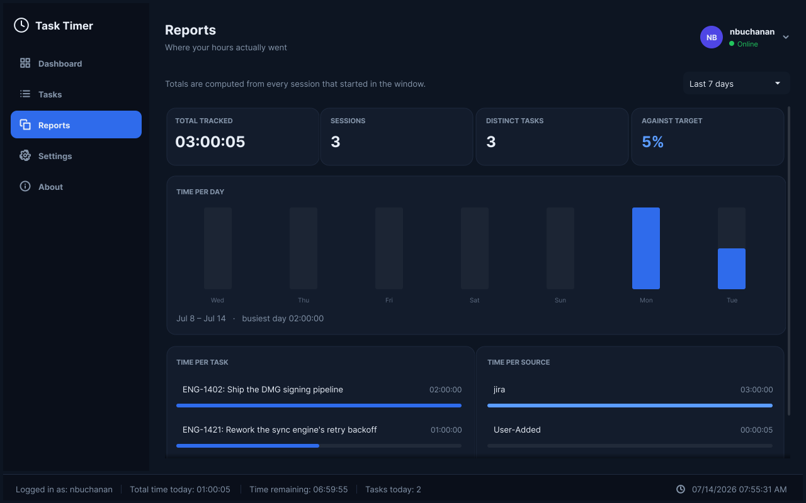
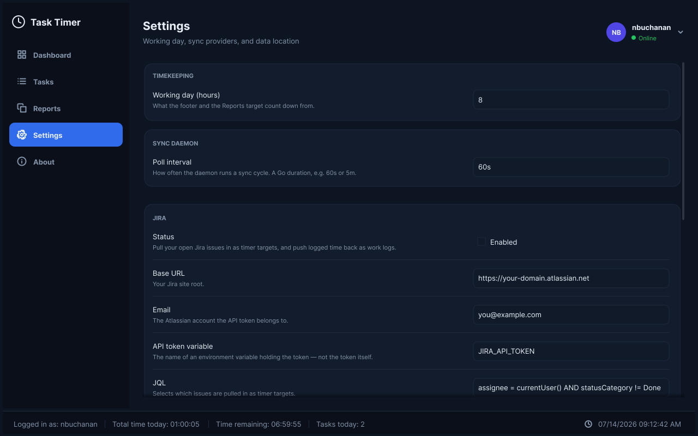

# Task Timer

Task Timer is a desktop stopwatch for people who have to account for their working day. You name a task, hit **Start**, and it records the session to a local SQLite database. A companion daemon can then reconcile those sessions through the Task Timer backend — pulling your assigned issues in as timer targets, and pushing your logged time back out as work logs.

The desktop app talks to exactly two things: the local SQLite database, and the Task Timer backend. Any integration with an external tracker (Jira, and whatever comes later) lives on the backend — the client holds no tracker credentials of any kind.

Everything is local by default. Nothing leaves your machine unless you explicitly configure a sync provider.



<details>
<summary>More screenshots</summary>

**Tasks** — the full session history, searchable and filterable.


**Reports** — where the hours actually went.


**Settings** — the working day and the sync providers.


</details>

---

## Contents

- [What you get](#what-you-get)
- [Prerequisites](#prerequisites)
- [Get the code](#get-the-code)
- [Run it](#run-it)
- [Build it](#build-it)
- [Set up syncing](#set-up-syncing)
- [Run the sync daemon in the background](#run-the-sync-daemon-in-the-background)
- [Where your data lives](#where-your-data-lives)
- [Build installable packages](#build-installable-packages)
- [Development](#development)
- [Troubleshooting](#troubleshooting)
- [Licence and third-party](#licence-and-third-party)

---

## What you get

The project builds **two** programs. They share one SQLite database and are useful independently — if you never want to sync anything, you only need the first.

| Program | Source | What it does |
| --- | --- | --- |
| `task-timer` | `cmd/task-timer` | The desktop app: the timer, the task table, reports, settings. |
| `task-timer-sync` | `cmd/task-timer-sync` | A headless daemon that pulls tasks from the Task Timer backend (or a JSON directory) and pushes your logged time back. Entirely optional. |

On macOS the built binaries are named `TaskTimer` and `TaskTimer-Sync`; on Linux and Windows they are `task-timer` and `task-timer-sync`. That is just a naming convention in the Makefile — they are the same programs.

---

## Prerequisites

### Go 1.23.2 or newer

Check what you have:

```bash
go version
```

You need **1.23.2 or newer** (this is the version pinned in `go.mod`). It was most recently built and tested against Go 1.26.4. If you do not have Go, install it from <https://go.dev/dl/>.

### A C compiler — this is not optional

Task Timer **requires cgo**. Two of its dependencies are C libraries wearing a Go coat:

- `go-sqlite3` compiles the actual SQLite C library.
- `Fyne`, the GUI toolkit, binds to OpenGL and (on Linux) X11.

So `CGO_ENABLED=0` will not work, and a machine with no C toolchain will fail to build with errors about `gcc` not being found. Install a compiler for your platform:

<details open>
<summary><b>macOS</b></summary>

```bash
xcode-select --install
```

That is all you need — it provides Clang, and the OpenGL frameworks ship with the OS.

</details>

<details>
<summary><b>Linux — Debian / Ubuntu</b></summary>

This is exactly the package list our build container uses, so it is known to compile:

```bash
sudo apt-get update && sudo apt-get install -y \
  gcc \
  pkg-config \
  libgl1-mesa-dev \
  libegl-dev \
  libx11-dev \
  libxrandr-dev \
  libxcursor-dev \
  libxinerama-dev \
  libxi-dev \
  libxxf86vm-dev \
  libxkbcommon-dev \
  libxss-dev
```

</details>

<details>
<summary><b>Linux — Fedora / RHEL</b></summary>

The equivalent packages (translated from the Debian list above, which is the one we build against):

```bash
sudo dnf install -y \
  gcc \
  pkgconf-pkg-config \
  mesa-libGL-devel \
  libX11-devel \
  libXrandr-devel \
  libXcursor-devel \
  libXinerama-devel \
  libXi-devel \
  libXxf86vm-devel \
  libxkbcommon-devel \
  libXScrnSaver-devel
```

</details>

<details>
<summary><b>Windows</b></summary>

Go on Windows needs a GCC to satisfy cgo. Install [MSYS2](https://www.msys2.org/), then from the MSYS2 UCRT64 shell:

```bash
pacman -S mingw-w64-ucrt-x86_64-gcc
```

Make sure `C:\msys64\ucrt64\bin` is on your `PATH` so that `gcc --version` works from an ordinary terminal.

If you would rather not deal with this, you can **build a Windows installer from macOS or Linux instead** — see [Build installable packages](#build-installable-packages). That path needs no Windows machine at all.

</details>

### Optional: Podman or Docker

Only needed if you want to **cross-compile for Linux/Windows** or **build installable packages** (`.deb`, `.rpm`, Windows installer). Not needed to build and run the app for yourself.

Install [Podman](https://podman.io/) (preferred — the Makefile picks it automatically if present) or [Docker](https://docs.docker.com/get-docker/). On macOS, Podman also needs a running VM:

```bash
podman machine init    # first time only
podman machine start
```

---

## Get the code

```bash
git clone <repository-url> task-timer
cd task-timer
```

> This repository does not yet have a public remote configured. If you were handed the source as a folder or an archive, just `cd` into it — every command below works from the repository root.

**Every Go dependency is vendored in** — the full source of both modules' dependencies is committed under `vendor/` (and `server/vendor/`). There is no `go mod download`, no network fetch, and no version-resolution step: `go build` uses the vendored tree automatically. You can build with the network unplugged. The only things you provide are the Go toolchain and, for the desktop app, a C compiler (see below) — a native GUI is compiled, not interpreted, so that part cannot be vendored away.

---

## Run it

The fastest way to see the app, straight from source:

```bash
go run ./cmd/task-timer
```

The first launch creates the database and a starter sync config in your data directory (see [Where your data lives](#where-your-data-lives)). The window opens with an empty task table.

**To time some work:**

1. Type a task name into the box under the clock — or pick one from the dropdown, which lists tasks you have used before plus anything pulled in from a sync provider.
2. Press **Start**.
3. Press **Stop** when you are done. The session is written to the database and appears in the table.

The three timer buttons are:

| Button | What it does |
| --- | --- |
| **Start** / **Stop** | Begins a session, or ends it and records it. |
| **Lap** | Banks the time so far as a completed session and *immediately restarts the clock on the same task*. Use it to log a chunk at a natural boundary — a commit, a meeting ending — without stopping work. |
| **Reset** | Throws away the running session without recording it. It asks for confirmation first. |

The footer counts your day down from an 8-hour working day. Change that on the **Settings** page.

---

## Build it

To compile real binaries for the machine you are on:

```bash
make build
```

They land in a directory named for your platform:

```text
build/bin/darwin-arm64/TaskTimer          # the app
build/bin/darwin-arm64/TaskTimer-Sync     # the sync daemon
```

Run the app directly:

```bash
./build/bin/darwin-arm64/TaskTimer
```

On Linux the path is `build/bin/linux-amd64/task-timer` (or `linux-arm64`, matching your CPU).

Everything the build produces is written under `build/` — nothing is scattered into the repository root or `/tmp`. To wipe it:

```bash
make clean
```

### All the make targets

```bash
make help
```

| Target | What it does |
| --- | --- |
| `make build` | Compile both binaries for the current machine. |
| `make test` | Run the full test suite. |
| `make vet` | Run `go vet`. |
| `make fmt` | Format the whole module with `gofmt`. |
| `make lint` | Run `golangci-lint`, if it is installed. |
| `make icons` | Regenerate every app icon from `internal/assets/icon.svg`. |
| `make docker-build` | Cross-compile Linux and Windows binaries in a container. |
| `make dmg` | Build `TaskTimer.dmg` (macOS host only). |
| `make deb` / `make rpm` / `make exe` | Build a Linux or Windows installer (needs a container). |
| `make package` | Every package this host can produce. |
| `make release` | `test` + `vet` + `build` + `package`, then list the artifacts. |
| `make clean` | Delete `build/`. |

---

## Set up syncing

Syncing is **off by default** and entirely optional. If you just want a local stopwatch, skip this section.

Two providers ship in the box:

| Provider | What it talks to |
| --- | --- |
| `gateway` | The Task Timer backend, which reaches your team's task tracker (e.g. Jira) on your behalf. The client holds only a bearer token — never a tracker credential. |
| `jsonfile` | A directory of JSON files. Useful for testing, scripting, or wiring up a tracker we do not support. |

Confirm what your binary has compiled in:

```bash
go run ./cmd/task-timer-sync -providers
```

```text
gateway
jsonfile
```

### The config file

Syncing is driven by `sync.json`, which lives in your data directory. **You do not have to write it from scratch** — run one sync cycle and the daemon will drop a fully-commented starter file in the right place and tell you where:

```bash
go run ./cmd/task-timer-sync -once
```

```text
database: /Users/you/Library/Application Support/TaskTimer/tasks.db
config:   /Users/you/Library/Application Support/TaskTimer/sync.json
provider gateway: disabled, skipping
provider jsonfile: disabled, skipping
no providers enabled; edit /Users/you/Library/Application Support/TaskTimer/sync.json to configure one
```

The file it writes contains **every provider compiled into your build**, present but switched off, with each one's settings spelled out:

```json
{
  "poll_interval": "60s",
  "providers": [
    {
      "name": "gateway",
      "enabled": false,
      "settings": {
        "api_token_env": "TASK_TIMER_GATEWAY_TOKEN",
        "base_url": "https://tasktimer.example.com",
        "complete_remote_tasks": false
      }
    },
    {
      "name": "jsonfile",
      "enabled": false,
      "settings": { "dir": "" }
    }
  ]
}
```

That file is **generated from the provider registry**, not written from a template — so a build with a new backend compiled in produces a starter config containing it, with no one having to remember to update an example.

You can edit it by hand, or use the app's **Settings** page, which renders a form for each provider and writes the file for you. Editing by hand is always safe: **keys the Settings form does not display are preserved when it saves**, so an inline `api_token` or a setting from a newer version will not be clobbered.

### Worked example: the `jsonfile` provider

This one needs no credentials and no network, so you can run it end to end right now to see how syncing behaves. It uses a scratch data directory so it will not touch your real one.

**1. Create a scratch workspace and a task to pull in:**

```bash
export TT=/tmp/tasktimer-demo
mkdir -p "$TT/exchange/tasks"

cat > "$TT/exchange/tasks/ENG-1.json" <<'EOF'
{
  "key": "ENG-1",
  "title": "Write the README",
  "url": "https://example.invalid/browse/ENG-1",
  "status": "In Progress",
  "assigned_by": "a.mcallister",
  "done": false,
  "updated_at": "2026-07-14T09:00:00Z"
}
EOF
```

**2. Point a config at that directory and turn the provider on:**

```bash
cat > "$TT/sync.json" <<EOF
{
  "poll_interval": "60s",
  "providers": [
    { "name": "jsonfile", "enabled": true, "settings": { "dir": "$TT/exchange" } }
  ]
}
EOF
```

**3. Run a single sync cycle:**

```bash
TASK_TIMER_DATA_DIR="$TT" go run ./cmd/task-timer-sync -once
```

```text
database: /tmp/tasktimer-demo/tasks.db
config:   /tmp/tasktimer-demo/sync.json
provider jsonfile: enabled
provider jsonfile: pulled 1 task(s)
```

**4. Open the app against the same scratch directory:**

```bash
TASK_TIMER_DATA_DIR="$TT" go run ./cmd/task-timer
```

`ENG-1: Write the README` is now in the task dropdown. Time a session against it, then run the daemon once more — it will write your work log into `$TT/exchange/worklogs/`.

The directory contract is:

```text
<dir>/tasks/*.json       read   — task definitions to pull in
<dir>/worklogs/*.json    write  — one file per synced session
<dir>/completed/*.json   write  — one file per completed task
```

Clean up with `rm -rf /tmp/tasktimer-demo`.

### Gateway (the Task Timer backend)

The `gateway` provider is how the client syncs against your team's task tracker. It never holds a tracker credential: the tracker integration (Jira, its OAuth app, which issues you see, whether you may close them) lives entirely on the backend server. The client only holds a **bearer token** that identifies you to that backend. See the [server README](server/README.md) for standing up and configuring the backend, or [SERVER.md](SERVER.md) for its architecture, the OAuth flow, and the API contract.

**1. Point the provider at your backend and log in.**

The backend URL is the only thing you configure by hand. Set it on the app's Settings page (the **Gateway URL** field), or drop it into `sync.json`, then sign in:

```bash
go run ./cmd/task-timer-sync -connect
```

This opens your browser, signs you in to the backend, and writes the bearer token to `sync.env` under `TASK_TIMER_GATEWAY_TOKEN` — the same file the daemon reads at startup. On the desktop app, the Settings page shows a **Log in** button that does the same thing. Either way, no token is ever typed into a config file or a text field.

**2. Enable the provider.** Either use the app's Settings page, or edit `sync.json`:

```json
{
  "poll_interval": "60s",
  "providers": [
    {
      "name": "gateway",
      "enabled": true,
      "settings": {
        "base_url": "https://tasktimer.example.com",
        "api_token_env": "TASK_TIMER_GATEWAY_TOKEN",
        "complete_remote_tasks": false
      }
    }
  ]
}
```

| Setting | Meaning |
| --- | --- |
| `base_url` | The Task Timer backend this client synchronises through. |
| `api_token_env` | The **name of an environment variable** holding the bearer token. `-connect` writes it there for you. |
| `complete_remote_tasks` | Let the app's **Complete** button close the remote issue. Defaults to `false`, and the backend must independently allow it — writing to a shared board is opt-in on both sides. |

Which issues you see, the query that selects them, and the transition used to close one are all decided by the backend, not the client — a client that could send an arbitrary query could read any issue its user can see, which is a wider surface than a timer needs.

**3. Test it with a single cycle** before leaving it running:

```bash
go run ./cmd/task-timer-sync -once
```

---

## Run the sync daemon in the background

The daemon is what actually talks to the backend. The desktop app only writes sessions to the local database — nothing is pulled or pushed until `task-timer-sync` is running.

For a one-off, leave it in a terminal; it loops on `poll_interval`:

```bash
task-timer-sync
```

**Every package ships a service definition**, so you do not have to write one. Pick your platform below.

### First: put your token where the daemon can see it

A daemon started by systemd or launchd **does not inherit your shell's exports**. `export TASK_TIMER_GATEWAY_TOKEN=...` in your `.bashrc` will not reach it, and the daemon will fail with a `401` that looks like a wrong token.

Running `task-timer-sync -connect` writes the token to `sync.env` in the data directory — beside `sync.json` — which is the same file the daemon reads at startup, so this is handled for you. If you ever need to place it by hand:

```bash
# macOS
printf 'TASK_TIMER_GATEWAY_TOKEN=your-token-here\n' > ~/Library/Application\ Support/TaskTimer/sync.env
chmod 600 ~/Library/Application\ Support/TaskTimer/sync.env

# Linux
printf 'TASK_TIMER_GATEWAY_TOKEN=your-token-here\n' > ~/.config/task-timer/sync.env
chmod 600 ~/.config/task-timer/sync.env
```

Format is `KEY=VALUE`, one per line; `#` comments and `export ` prefixes are fine. A variable already set in the real environment always wins. The daemon logs the variable **names** it loaded, never the values, and warns you if the file is readable by other users.

This is why none of the service definitions below contain a secret.

<details>
<summary><b>macOS — login agent</b></summary>

The app bundle ships the agent and a script to install it:

```bash
/Applications/TaskTimer.app/Contents/Resources/sync-agent.sh install
```

That writes `~/Library/LaunchAgents/com.tasktimer.sync.plist`, pointed at the daemon inside the bundle, and starts it. It logs to `~/Library/Logs/task-timer-sync.log`.

```bash
/Applications/TaskTimer.app/Contents/Resources/sync-agent.sh status
/Applications/TaskTimer.app/Contents/Resources/sync-agent.sh uninstall
```

The script resolves the daemon's path from its own location, so a bundle you run from `~/Applications` still installs a working agent.

</details>

<details>
<summary><b>Linux — systemd user service</b></summary>

The `.deb` and `.rpm` install `/usr/lib/systemd/user/task-timer-sync.service`. Enable it for **your own user** — it is a user service, because the database and the token are yours, not the machine's:

```bash
systemctl --user enable --now task-timer-sync.service
systemctl --user status task-timer-sync.service
journalctl --user -u task-timer-sync -f
```

It is **not** enabled automatically on install. It polls your issue tracker over the network, and a package should not switch that on for every account on a machine without being asked.

</details>

<details>
<summary><b>Windows — run at login</b></summary>

The installer offers **"Run the sync daemon at login"** as an optional component on the Components page. It is unticked by default; tick it and the installer adds a Startup shortcut, and the daemon runs from your next sign-in.

The daemon is installed either way, so you can also just run `task-timer-sync.exe` from the install directory whenever you want.

</details>

> Whatever you choose, the daemon does **nothing** until you enable a provider — in the app's Settings page, or in `sync.json`. An enabled service with no providers is a harmless idle loop.

### Daemon flags

| Flag | Meaning |
| --- | --- |
| `-once` | Run a single sync cycle and exit. Ideal for testing, or for a cron job. |
| `-providers` | List the compiled-in providers and exit. |
| `-config <path>` | Use a config file somewhere other than the data directory. |

---

## Where your data lives

Both programs share one database and one config file, in a platform-appropriate directory:

| Platform | Location |
| --- | --- |
| macOS | `~/Library/Application Support/TaskTimer/` |
| Linux | `~/.config/task-timer/` |
| Windows | `%APPDATA%\TaskTimer\` |

It holds `tasks.db` (your work sessions) and `sync.json` (the provider config). The **About** page in the app shows the exact paths on your machine.

Override the location with an environment variable — useful for testing, for a portable install, or for keeping work and personal time apart:

```bash
TASK_TIMER_DATA_DIR=/path/to/data go run ./cmd/task-timer
```

`tasks.db` is an ordinary SQLite database. Nothing stops you querying it:

```bash
sqlite3 ~/Library/Application\ Support/TaskTimer/tasks.db \
  "SELECT name, duration, task_status FROM tasks ORDER BY id DESC LIMIT 5;"
```

---

## Build installable packages

Everything lands in `build/dist/`.

### macOS: `.app` and `.dmg`

Runs natively, no container needed:

```bash
make dmg
```

Produces `build/dist/TaskTimer.app` and `build/dist/TaskTimer.dmg`.

> The bundle is **not code-signed or notarised**. On first launch macOS will refuse to open it; right-click the app and choose **Open**, then confirm. Signing requires an Apple Developer certificate and is out of scope here.

### Linux and Windows: cross-compiled in a container

You do not need a Linux or Windows machine. Both are cross-compiled inside a container image that carries the X11/GL headers and the two mingw toolchains, so this all works from macOS.

> **Three targets.** `Dockerfile.build` pins the builder to `linux/arm64`, and it cross-compiles for exactly **`linux/arm64`**, **`windows/amd64`** and **`windows/arm64`**. That is why the Linux packages below come out as `arm64`/`aarch64`. There is still **no `linux/amd64` package target** — if you need `.deb`s for an Intel or AMD server, build them natively on such a machine with `make build`, or add an `amd64` stanza to `Dockerfile.build`.
>
> **Why two Windows toolchains.** Debian's `mingw-w64` only targets x86, so it cannot build `windows/arm64` at all. That target is built with [llvm-mingw](https://github.com/mstorsjo/llvm-mingw) (clang-based, and it does target aarch64), which the image downloads at build time; `windows/amd64` stays on GCC mingw. Cgo is mandatory here — Fyne and go-sqlite3 both need a C compiler — so a pure-Go `GOARCH=arm64` build is not an option.

```bash
make docker-build     # cross-compile the binaries
make deb              # build/dist/task-timer_1.0.0_arm64.deb
make rpm              # build/dist/task-timer-1.0.0-1.aarch64.rpm
make exe              # build/dist/task-timer-installer-{amd64,arm64}.exe
```

Windows ships **one installer per CPU**. Give people on Arm laptops (Snapdragon X, Surface Pro X) the `arm64` one; everyone else takes `amd64`. Each installer checks the machine's real CPU on startup and refuses to install onto one it cannot run on, so a mix-up is a clear error message rather than an app that installs and then won't launch.

> **`windows/arm64` is built and linked, but not yet verified on real hardware.** Fyne draws through desktop OpenGL, and Windows on ARM has no guaranteed native OpenGL driver — depending on the machine it may need Microsoft's OpenGL/OpenCL Compatibility Pack, or fall back to a mapping layer. If the arm64 GUI fails to start on an Arm PC, that is the first thing to check; the `amd64` installer also runs on those machines under emulation and is the safe fallback. `task-timer-sync.exe` has no GUI and is unaffected.

Or all three in one container run:

```bash
make docker-package
```

The first run pulls a base image and installs a cross-compiler toolchain, so expect it to take several minutes. Subsequent runs are cached and fast.

Install the results the usual way, on an **arm64** machine:

```bash
sudo dpkg -i build/dist/task-timer_1.0.0_arm64.deb     # Debian/Ubuntu
sudo rpm -i build/dist/task-timer-1.0.0-1.aarch64.rpm  # Fedora/RHEL
```

### Everything at once

```bash
make release
```

Runs the tests, vets, builds, packages everything this host can produce, and prints the list of artifacts.

---

## Development

> **Working on the code?** Two companion guides go deeper than this section:
> [DEVELOPER.md](DEVELOPER.md) — the client's architecture, the provider plugin
> system, data flow, and how to add a backend — and [SERVER.md](SERVER.md), Task
> Timer Server's architecture, OAuth flow, and API contract.

### The test suite

```bash
make test
```

Alongside the ordinary unit tests, `internal/ui` has a **render test** that builds the entire interface on a headless Fyne canvas and lays out all five pages. It catches two classes of bug that a compiler will not: a page that crashes while constructing itself, and a layout that overflows the window (which, in Fyne, produces a window the user physically cannot shrink).

It can also write a PNG of every page — which is how you review the design without launching anything, and it works over SSH:

```bash
TASK_TIMER_SHOTS=/tmp/shots go test ./internal/ui -run TestRenderPages
open /tmp/shots      # 'xdg-open' on Linux
```

The screenshots at the top of this README were produced exactly that way.

### Formatting and linting

```bash
make fmt
make vet
make lint    # needs golangci-lint; skipped with a message if absent
```

`golangci-lint` is not bundled. Install it with:

```bash
go install github.com/golangci/golangci-lint/cmd/golangci-lint@latest
```

### Icons

`internal/assets/icon.svg` is the single source of truth for the app icon. Everything else — the macOS `.icns`, the Windows `.ico`, the PNG embedded in the binary — is generated from it:

```bash
make icons
```

If you change the SVG, run this and commit the regenerated `internal/assets/icon.png` along with it.

### Project layout

| Path | What is in it |
| --- | --- |
| `cmd/task-timer/` | The desktop app's entry point. Just wiring. |
| `cmd/task-timer-sync/` | The sync daemon's entry point. |
| `internal/ui/` | The whole interface: theme, shared components, and the five pages. |
| `internal/task/` | The domain model, the SQLite store, and the reporting aggregation. |
| `internal/sync/` | The sync engine and the provider interface. |
| `internal/sync/providers/` | The gateway and JSON-file providers. |
| `internal/assets/` | The app icon and the embedded fonts. |
| `tools/icongen/` | The icon generator. |
| `pkg/`, `scripts/` | Packaging scripts (`.dmg`, `.deb`, `.rpm`, Windows installer). |

### Adding a sync provider

Backends are **plugins**. The gateway is not special — it is just one of them. Nothing in the engine, the store, the config layer or the app knows any particular backend exists.

To add one (GitHub Issues, Linear, Asana…):

**1. Implement `sync.Provider`** in a new package under `internal/sync/providers/`. `Pull` and `Push` are independent — implement one and return `sync.ErrUnsupported` from the other if that is all your backend can do.

**2. Register it from `init()`, declaring your settings as `Fields`:**

```go
func init() {
    tsync.Register(tsync.Registration{
        Name:    "linear",
        Title:   "Linear",
        Summary: "Pull assigned Linear issues and push time back.",
        New:     New, // func(json.RawMessage) (tsync.Provider, error)
        Fields: []tsync.Field{
            {
                Key:     "api_key_env",
                Label:   "API key variable",
                Hint:    "The name of an environment variable holding the key.",
                Kind:    tsync.KindText,
                Default: "LINEAR_API_KEY",
            },
            {
                Key:     "push_time",
                Label:   "Time tracking",
                Kind:    tsync.KindBool,
                Default: true,
            },
        },
    })
}
```

**3. Add one blank import** to `cmd/task-timer-sync/main.go` and `cmd/task-timer/main.go`.

That is the whole job. Because you declared `Fields`, you get all of this for free:

- The provider appears in `task-timer-sync -providers`.
- It is written into the starter `sync.json`, with your defaults filled in.
- **The app's Settings page renders a form for it** — a card, an enable toggle, and the right control for every field.

> **The rule that makes this work:** `internal/ui` must never import a provider package. The settings screen is built by walking `sync.Descriptors()`, so it can configure a backend it has never heard of. Only a binary's `main` may name a provider.
>
> This is enforced by `TestAppDoesNotDependOnAnyProvider` in `internal/sync/architecture_test.go`, which fails the build if the app, the engine, or the store grows a dependency on any backend. An earlier version of the settings page bound its form directly to a provider's own `Config` type — it compiled and it worked, and it quietly meant that adding Linear would have required editing the app. A plugin system whose host must be modified for each plugin is not a plugin system.

**Secrets:** declare the *name of an environment variable*, not the secret. A field you do not declare is never rendered, and is preserved untouched when the Settings page saves — which is how the gateway supports an inline `api_token` for hand-editing while keeping it off the screen.

---

## Troubleshooting

**`gcc: command not found`, or errors mentioning `cgo`**
You are missing a C compiler. See [Prerequisites](#prerequisites). Also confirm cgo has not been disabled: `go env CGO_ENABLED` must print `1`.

**Linux: `fatal error: X11/Xlib.h: No such file or directory` (or similar missing headers)**
You are missing the X11/OpenGL development packages. Install the list in [Prerequisites](#prerequisites).

**The app builds but no window appears**
The GUI needs a real display. It will not open a window over a plain SSH session, inside a container, or on a headless server. To inspect the interface in those environments, use the PNG render test described under [Development](#development).

**`no providers enabled; edit .../sync.json to configure one`**
Expected on first run — syncing ships switched off. Set `"enabled": true` on the provider you want, in the file the message points at.

**Gateway: `401 Unauthorized`**
Either the bearer token has been revoked, or the variable named by `api_token_env` is not set *in the environment the daemon actually runs in*. This is the classic failure for a service: launchd and systemd inherit none of your shell's exports, so a setup that works perfectly from a terminal dies as a daemon.

Run `task-timer-sync -connect` to sign in again; it writes the token to `sync.env` in the data directory, which is where the daemon looks. The daemon logs the variable names it loaded at startup, so you can see whether it found them:

```text
env:      /home/you/.config/task-timer/sync.env (TASK_TIMER_GATEWAY_TOKEN)
```

If that line is absent, the daemon has no token.

**Gateway: work logs are pushed, but issues never close**
Completion is opt-in on both sides. The client's `complete_remote_tasks` defaults to `false`, and the backend has its own switch as well — both must be on for the **Complete** button to close an issue.

**Sessions shorter than a minute show as one minute upstream**
Working as intended. One minute is the shortest work log the upstream tracker accepts, so shorter sessions are rounded up by the backend rather than dropped.

**`make dmg` fails with `./scripts/mac-app.sh: Permission denied`**
The build scripts have lost their executable bit — which happens if the source reached you as a `.zip` or `.tar` that did not preserve file modes. Restore it:

```bash
chmod +x scripts/*.sh pkg/*.sh
```

**macOS refuses to open the app: "cannot be opened because the developer cannot be verified"**
The bundle is unsigned. Right-click it and choose **Open**, then confirm the dialog. Signing and notarising require an Apple Developer certificate.

**Podman: `Cannot connect to Podman`**
The VM is not running. `podman machine start`.

---

## Licence and third-party

The interface is set in [Inter](https://github.com/rsms/inter) 3.19 by Rasmus Andersson, used under the [SIL Open Font License 1.1](internal/assets/fonts/OFL.txt). The font files and their licence are vendored in `internal/assets/fonts/`.

The GUI is built with [Fyne](https://fyne.io/). Storage is [go-sqlite3](https://github.com/mattn/go-sqlite3).
